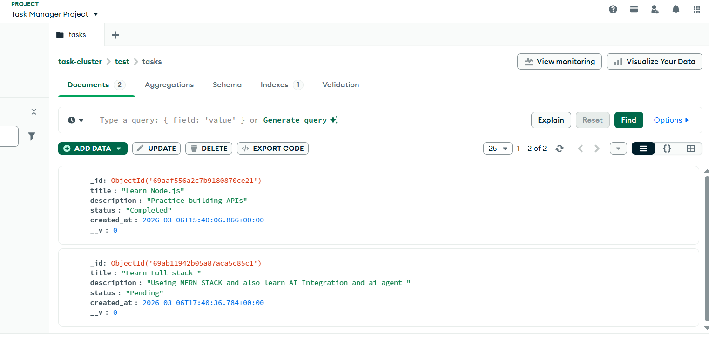

# Task Manager Application

A simple full-stack task management application built for the technical assessment.

## Project Screenshot

## Tech Stack

Frontend
- React

Backend
- Node.js
- Express.js

Database
- MongoDB Atlas

## Features

- Add a task
- View all tasks
- Mark task as completed
- Delete task
- Basic validation

## API Endpoints

POST /api/tasks  
GET /api/tasks  
PUT /api/tasks/:id  
DELETE /api/tasks/:id  

## Project Structure

backend/
frontend/

## Setup Instructions

1 Clone repository

git clone <https://github.com/NavinKumar8816/task-manager-app>

2 Backend setup

cd backend
npm install
npx nodemon server.js

3 Frontend setup

cd frontend
npm install
npm start

## Database

MongoDB Atlas Free Tier

## Project Database Screenshot

## Author

Navin Kumar